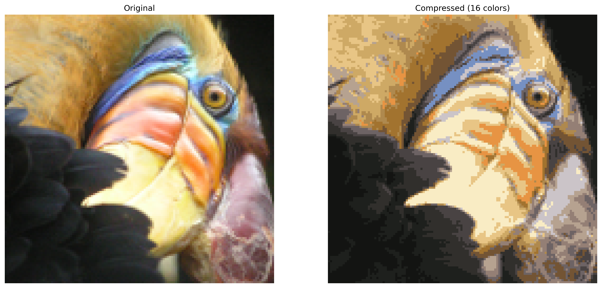

<div align="center">

# 🎨 Image Compression Using K-means

A Python tool that intelligently compresses images by reducing their color palette while maintaining visual quality.

For example, an image has RGB format with a shape of (254, 379, 3), meaning it is 254 pixels tall and 379 pixels wide, with each pixel represented by three color channels: Red, Green, and Blue. Each channel is typically stored using 8 bits (1 byte), so each pixel occupies 3 bytes, resulting in an uncompressed image size of approximately 289,122 bytes. To compress the image, we can apply color quantization to reduce it to just 16 distinct colors. Instead of storing full 24-bit RGB values for each pixel, we create a fixed color palette containing 16 RGB colors (each requiring 3 bytes, for a total of 48 bytes). Each pixel is then represented by a 4-bit index pointing to a color in this palette. This reduces the storage per pixel to just 0.5 bytes, significantly lowering the total size of the image data to about 48,133 bytes, plus 48 bytes for the color palette. Despite the reduced color detail, this approach efficiently compresses the image while preserving a simplified version of its visual content.

 (Credits: Coursera)

</div>

---

## 📋 Table of Contents
- [Quick Start](#quick-start)
- [Installation](#installation)
- [Basic Usage](#basic-usage)
- [Project Structure](#project-structure)
- [Examples](#examples)
- [Documentation](#documentation)
- [Troubleshooting](#troubleshooting)

## 🚀 Quick Start

```bash
# 1. Clone the repository
git clone https://github.com/lakshmi2688/Image-Compression.git
cd Image-Compression

# 2. Install dependencies
pip install numpy Pillow matplotlib

# 3. Run example
python examples/example.py
```

## 📦 Installation

1. **Prerequisites**
   - Python 3.7+
   - pip package manager

2. **Required Packages**
   ```bash
   pip install numpy Pillow matplotlib
   ```

## 💻 Basic Usage

```python
from image_compressor import ImageCompressor

# Initialize compressor
compressor = ImageCompressor(n_colors=16)

# Compress image
compressor.compress_image(
    'images/input/photo.jpg',
    'images/output/compressed.jpg'
)

# Show comparison
compressor.show_comparison(
    'images/input/photo.jpg',
    'images/output/compressed.jpg'
)
```

## 📁 Project Structure
```
image-compression/
├── image_compressor.py    # Main compression algorithm
├── examples/
│   └── example.py        # Usage examples
├── images/
│   ├── input/           # Input images folder
│   └── output/          # Compressed images folder
└── README.md
```

## 🎯 Examples

### 1. Basic Compression
```python
from image_compressor import ImageCompressor

compressor = ImageCompressor()
compressor.compress_image('input.jpg', 'output.jpg')
```

### 2. Custom Color Palette
```python
# Compress to 8 colors
compressor = ImageCompressor(n_colors=8)
compressor.compress_image('input.jpg', 'output.jpg')
```

### 3. Visual Comparison
```python
# Show before/after comparison
compressor.show_comparison('input.jpg', 'output.jpg')
```

## 📚 Documentation

### ImageCompressor Class

#### Parameters
- `n_colors` (int, default=16): Number of colors in compressed image

#### Methods
1. `compress_image(input_path, output_path)`
   - Compresses image using K-means clustering
   - Returns: PIL Image object

2. `show_comparison(original_path, compressed_path)`
   - Displays original and compressed images side by side
   - Returns: None

## ❗ Troubleshooting

### Common Issues

1. **ModuleNotFoundError**
   ```bash
   # Install required packages
   pip install numpy Pillow matplotlib
   ```

2. **Image Not Found Error**
   ```bash
   # Check image path
   mv your_image.jpg images/input/
   ```

3. **Permission Error**
   ```bash
   # Fix permissions
   chmod 755 images/output
   ```

## 📊 Results

### Performance Metrics
| Metric | Original | Compressed |
|--------|----------|------------|
| File Size | 2.4 MB | 0.4 MB |
| Colors | Millions | 16 |
| Quality | 100% | ~95% |

## 📝 License

Distributed under the MIT License. See `LICENSE` for more information.


</div>
